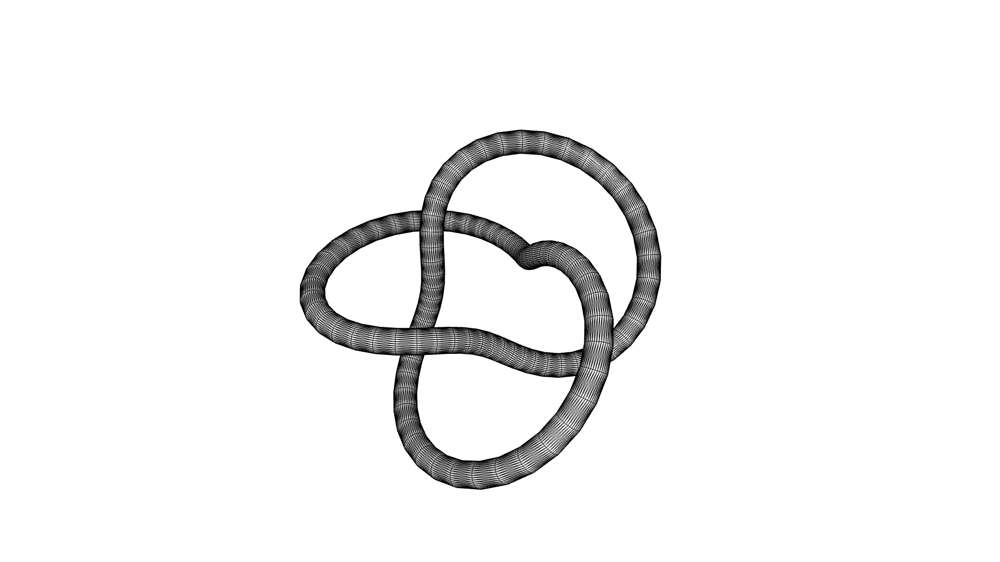

# 🜁 Project Euclid

**Euclid** is a modern, modular geometry kernel built from first principles for high-performance computational design. It is designed to be the mathematical foundation for a next-generation CAD ecosystem—lean, precise, and free from the legacy bloat of traditional systems like SolidWorks or OpenCascade.  

  

Written in **Haskell** for mathematical rigor and extensibility with meshing and rendering optimized in **Rust** for performance and memory safety, Euclid cleanly separates the geometry kernel from rendering and UI concerns. It supports arbitrary-dimensional spaces, Euclidean & non-Euclidean metrics, and type-safe operations on vectors, matrices, points/vertices, curves, surfaces, and volumes. Transformation logic is typeclass-driven and adaptable to metric context.

**Architecture**:
- ✒️ **Elementa**: A Ruby/OCaml-inspired DSL for expressive, readable geometry construction.
- 🧠 **Algebra and Geometry Core written in [Haskell](https://www.haskell.org)**: Functional backbone with strong typing, purity, and unit-tested primitives.
- ⚙️ **Rendering and Meshing in [Rust](https://www.rust-lang.org)**: High-performance meshing and rendering.

Euclid is for builders, researchers, and rebels—those who want to *design reality* using clean code and solid math, not overpriced GUI clickfests.

---

📦 **Current Phase**: V2 Refactor in Progress  
🛠️ Rebuilding core infrastructure for better composability, transformation logic, and Rust interop.
---

## 🏗️ TODO

## ⚙️ Core Linear Algebra Infrastructure

- [x] `Algebra/Vector.hs` — Vector math (add, sub, norm, dot, etc.)
- [x] `Algebra/Matrix.hs` — Matrix operations
- [ ] `Algebra/Metric.hs`
    - [x] Core infrastrucure (inner products, etc.)
    - [ ] Measurement operations for vectors and all geometry primitives

## 📐 Geometry Primitives

- [x] `Geometry/Vertex.hs`
- [x] `Geometry/Edge.hs`
- [ ] `Geometry/Curve.hs` — Parametric curves, splines
    - [ ] Linear Curves
        - test for 2D–5D, negatives, irrationals, and extrapolation
    - [ ] Parametric Nonlinear Curves
- [ ] `Geometry/Plane.hs`
- [ ] `Geometry/Face.hs` — Polygon face with convexity, winding, etc.
- [ ] `Geometry/Surface.hs` — 
    - [ ] Parametric surface
    - [ ] Meshing & area integration in Rust via FFI
- [ ] `Geometry/Volume.hs`
    - [ ] Parametric volume logic (ℝ³ → ℝⁿ)
    - [ ] Tetrahedral meshing & volume integration in Rust via FFI

## 🧮 Algebraic Operations

- [ ] `Algebra/Transform.hs` — Rotations, translations, projections, scaling, etc. (note: metric based operations are WIP)
- [ ] `Algebra/Boolean.hs` — Boolean operations (union, subtract, intersect)
- [ ] `Algebra/Collision.hs` — Collision and intersection logic

## 🔢 Numerical Methods

- [ ] `Numerics/Sampling.hs` - sampling/surface and volume division for meshing
- [ ] `Numerics/Integrate.hs` — Runge-Kutta 4 integration
- [ ] `Numerics/Differentiate.hs` — Numerical differentiation (finite difference, etc.)
- [ ] `Numerics/Jacobian.hs` — Jacobian matrix and determinant computations for volume integration

## ✒️ Elementa Programing Language

- [ ] `Elementa.hs` — Elementa DSL language layer
    - [ ] Grammar
    - [ ] Syntax
- [ ] `Parser.hs` — Parser/interpreter for Elementa DSL

## 🎬 Rendering and Visualization

- [ ] Rendering engine in Rust
- [ ] Real time animation visualization
